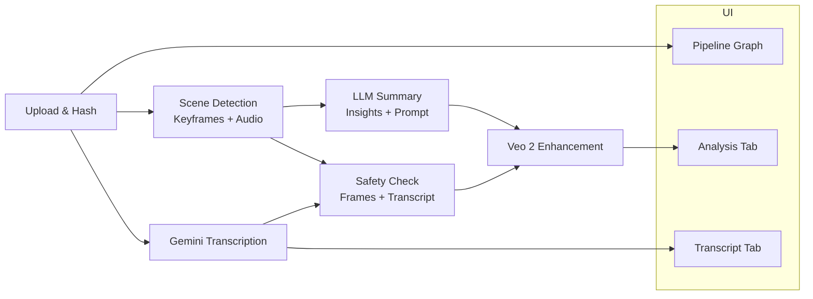

# Ad Astra – Modular GenAI Ad Testing Framework

> “To the stars.” Ad Astra helps marketing teams launch, evaluate, and iterate on creative concepts faster than ever, using a modular GenAI pipeline purpose-built for advertising.

---

## 🚀 Why Ad Astra?

Modern marketing teams need more than transcripts and clip scorers—they need a launchpad. Ad Astra orchestrates Google’s Gemini models, Veo 2 video generation, and visual/audio analytics inside a node-based workflow that feels familiar to n8n or Airflow, while staying laser-focused on ad quality and compliance.

Whether you want to analyze, criticise, or enhance an AI-generated spot, Ad Astra lets you mix and match pipeline nodes, visualize dependencies, and re-run individual steps without restarting the whole rocket.

---

## ✨ Feature Highlights

- **Modular Pipeline Graph** – Interactive React Flow UI shows every stage (upload, scene detection, transcription, safety, LLM, enhancement) with live status and manual triggers.
- **Scene-Aware Preprocessing** – PySceneDetect finds cuts, extracts five keyframes per scene, and keeps per-scene audio for downstream models.
- **Gemini-Powered Transcription** – Google Gemini transforms audio into transcripts, summaries, and key prompts with smart caching.
- **Safety & Ethics Radar** – Detect NSFW cues, bias, or misleading claims across transcript and keyframes with tiered risk scoring.
- **Veo 2 Enhancer** – Generate refreshed ad variations in 4–8 second clips using the official Veo 2 model and LLM-driven prompts.
- **Smart Cache Layer** – Re-uses video, audio, transcript, and safety artifacts based on hash so re-runs hit cached responses in <1s.
- **Developer-Friendly API** – FastAPI endpoints let you drive the same analytics programmatically.

---

## 🌌 UI Tour

| View | What You Get |
|------|---------------|
| **Video Analysis** | Upload ads, inspect analyzer outputs, run Veo 2 enhancement with duration/aspect controls |
| **Transcript Lab** | One-click transcription, Gemini summary, run-once safety check, cached indicators |
| **Pipeline Graph** | N8n-style node canvas showing each module’s state and manual triggers with a coordinating micro-dashboard |

All buttons and inputs share the same pastel/gradient aesthetic, so sliding between tabs feels cohesive.

---

## 🧩 Architecture at a Glance



### Modules
- **Backend /preprocessing** – `AudioProcessor` coordinates scene detection, keyframes, and audio extraction.
- **Backend /analyzers** – `TranscriptionService` (Gemini) and `SafetyChecker` (multi-step scoring).
- **Backend /pipeline** – `veo_enhancer.py` orchestrates Veo 2 calls using LLM prompts and user-selected parameters.
- **Frontend** – React + React Flow for graph nodes, TypeScript for tabbed UI, shared theming.

---

## ⚙️ Quick Start

### Prerequisites

- Python 3.9+
- Node.js 18+
- Google AI Studio API key (Gemini + Veo access)

### Install & Launch

```bash
# Clone
git clone <repo-url>
cd hack-nation-hackathon

# Backend
cd backend
python -m venv .venv && source .venv/bin/activate
pip install -r requirements.txt
echo "GOOGLE_AI_STUDIO_API_KEY=your_key" > .env
uvicorn main:app --reload --port 8000

# Frontend (new terminal)
cd ../frontend
npm install
npm run dev
```

Open **http://localhost:3000**. Backend lives at **http://localhost:8000**.

---

## 🔌 Key Endpoints

| Endpoint | Purpose |
|----------|---------|
| `POST /analyze-video` | Full pipeline (scene detection, LLM summary, caching) |
| `POST /transcript` | Gemini-powered transcript + summary + key points |
| `POST /safety-check` | Run full safety analysis using cached transcript/keyframes |
| `POST /enhance-video` | Veo 2 enhancement (accepts `max_scenes`, `aspect_ratio`, `duration_seconds`, `video_count`) |

All endpoints reuse artifacts via hash-based caching, saving compute and billing credits.

---

## 🗂️ Project Structure

```
hack-nation-hackathon/
├── backend/
│   ├── analyzers/            # Gemini transcription & safety modules
│   ├── preprocessing/        # Scene detection & audio extraction
│   ├── pipeline/             # Veo 2 enhancement orchestration
│   ├── docs/                 # Technical notes (safety, transcription, Veo)
│   ├── main.py               # FastAPI application
│   └── Makefile              # Artifact cleanup helpers
├── frontend/
│   ├── src/
│   │   ├── App.tsx           # Tabbed UI + pipeline graph integration
│   │   ├── PipelineGraph.tsx # React Flow nodes & triggers
│   │   └── Transcript.tsx    # Transcript detail view
│   └── vite.config.ts
└── README.md                 # You are here
```

---

## 🧪 Testing & Tooling

```bash
# Backend smoke tests
cd backend
python3 test_processor.py        # Scene detection
python3 test_transcription.py    # Gemini transcription
python3 test_transcript_endpoint.py
python3 test_safety_checker.py   # Safety pipeline

# Frontend lint (if configured)
cd frontend
npm run lint
```

Cleanup helpers (backend):

```bash
make list-artifacts   # Show disk usage
make clean-artifacts  # Remove outputs (keep uploads)
make clean-all        # Nuke caches (use with caution)
```

---

## 🚧 Roadmap Ideas

- Veo 3.x reference image support + continuity controls
- Batch job orchestration (queue + worker model)
- Hosted templates for A/B testing creative variants
- Built-in prompt library for different industries

---

## 🌠 About the Name

**Ad Astra** means “to the stars.” Our mission is to help companies scale AI-driven marketing campaigns beyond the ordinary, with a launchpad that keeps humans in control and compliance in check.

---

## 🙌 Credits

- FastAPI, PySceneDetect, MoviePy, Pydub
- Google Gemini (Transcription & Safety), Veo 2 (Video Generation)
- React, Vite, React Flow

---

